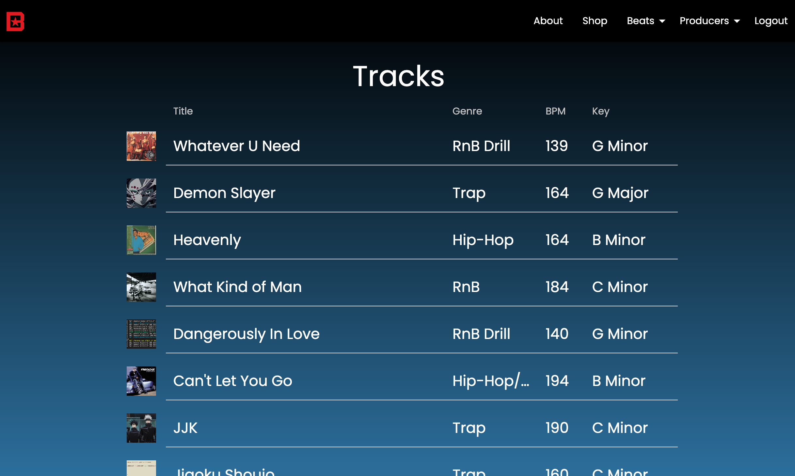
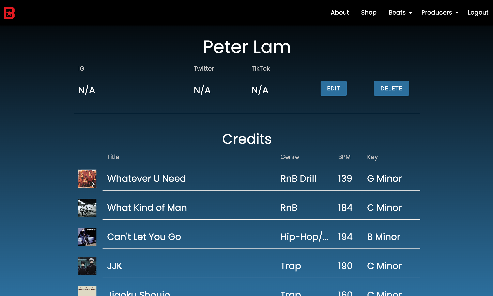

# BeatStars

#### A music marketplace where users can buy and sell beats.

##  Deployed Link
- [BeatStars](https://beatstore-pl.herokuapp.com/)

## Table of Contents
- [Technologies Used](#technologiesused)
- [Features](#features)
- [Wireframe](#wireframe)
- [Trello](#trello)
- [BeatStars](#deployment)
- [Resources](#resources)
- [Future Implementations](#futureimplementations)

##  Technologies Used
- Python
- Django
- PostgreSQL
- Amazon S3
- HTML
- CSS
- Materialize

##  Features
- Non-users can shop all tracks on the site
- Non-users can view producers who use the site and their credits
- Users can upload, edit, and delete Beats and Producer profiles
- Users can leave comments on beats

##  Wireframe
- My application was modeled after my actual BeatStars site.

##  Trello
- [Trello](https://trello.com/b/j4vVli2m/beatstars)

##  Resources:
- [MDN](https://developer.mozilla.org/en-US/)
- [StackOverflow](https://stackoverflow.com/)
- [Django](https://docs.djangoproject.com/en/4.1/)
- [AWS S3](https://docs.aws.amazon.com/s3/)
- [Materialize](https://materializecss.com/)

##  Future Implementations
- Paywall
